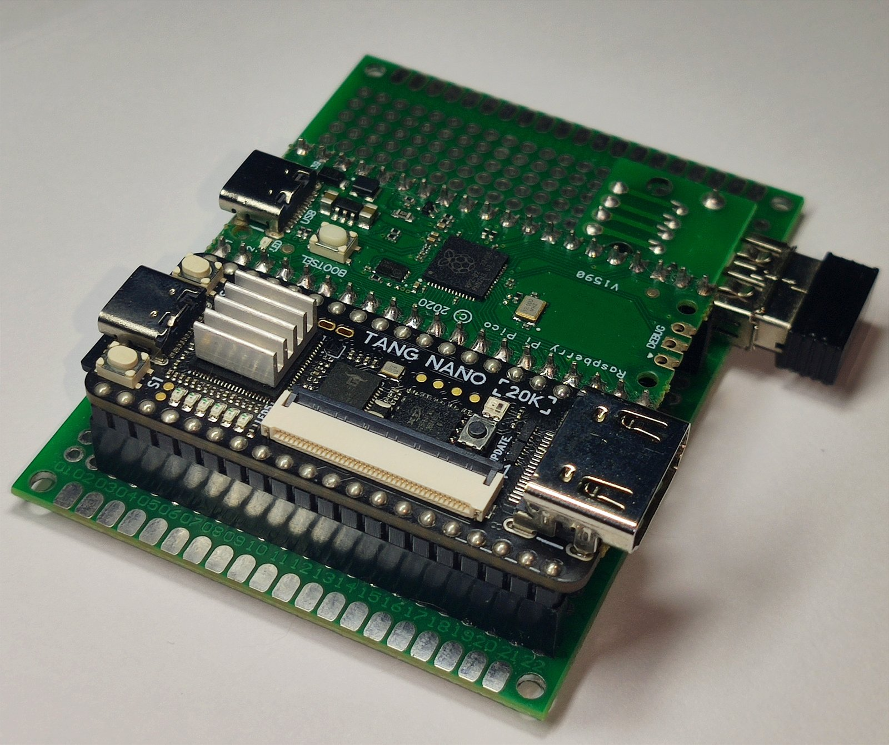
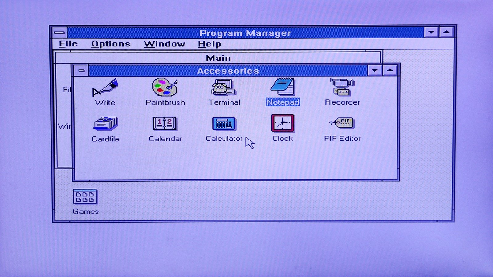
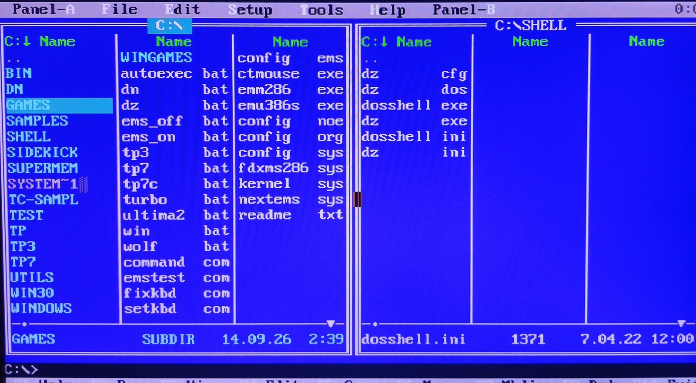
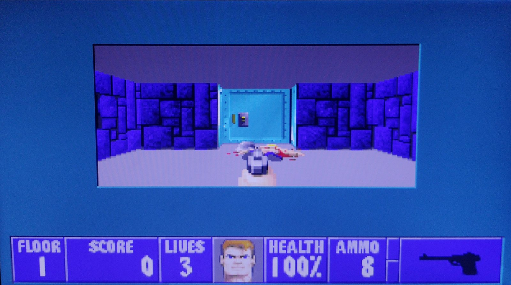
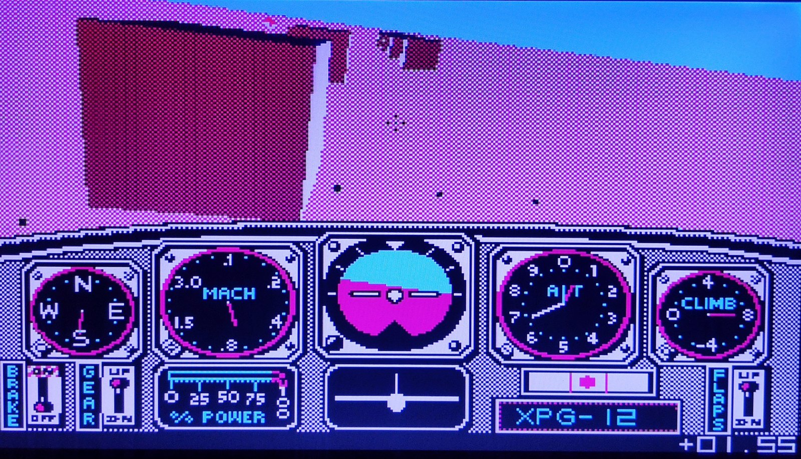
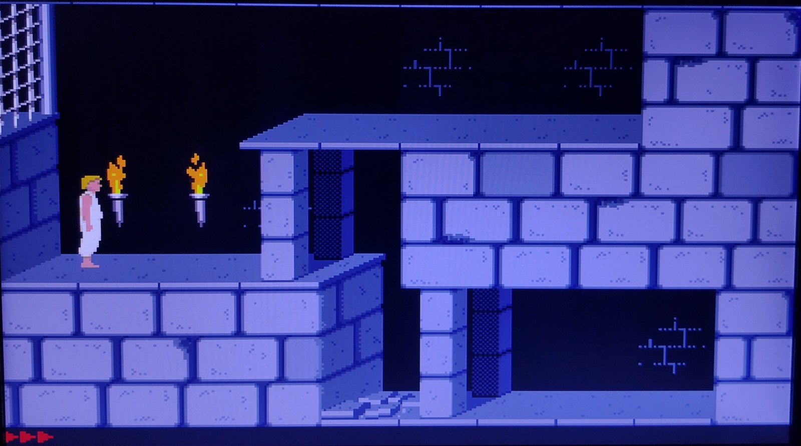
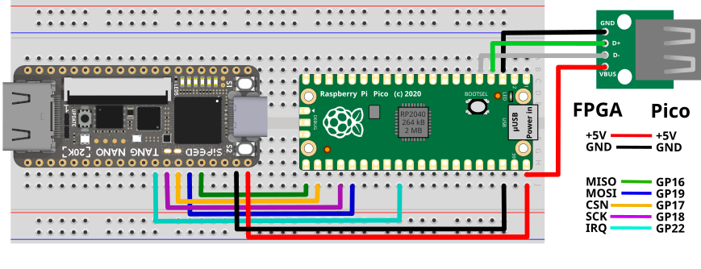
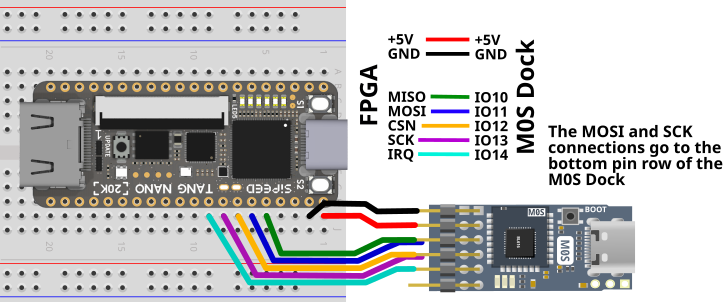
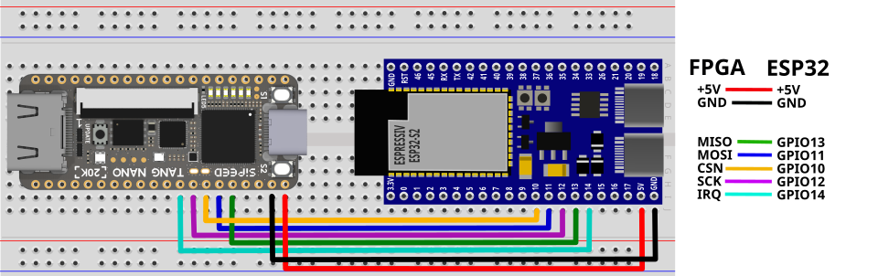
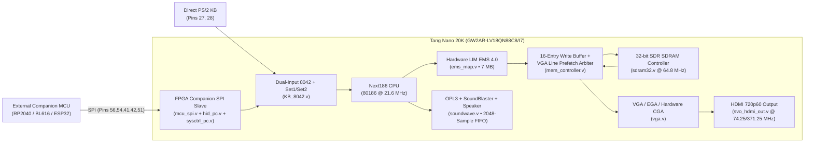

# Next186 SoC PC for Sipeed Tang Nano 20K (`Next186_S_20K`)

[](https://wiki.sipeed.com/hardware/en/tang/tang-nano-20k/nano-20k.html)
[](#1-clock-architecture--cpu-overclocking-216-mhz)
[-orange)](#3-hardware-lim-ems-40-expanded-memory-7-mb)
[-purple)](#4-video-subsystem-vga-ega-planar-fix--hardware-cga-emulation)
[](#6-audio-subsystem-overhaul-deep-fifo-adlibopl3-sound-blaster)
[_&_PS/2-brightgreen)](#step-3-connect-a-keyboard--mouse)

A complete, overclocked port of Nicolae Dumitrache's **Next186 SoC PC** (80186-compatible retro DOS PC with HDMI 720p60 VGA/EGA/CGA graphics, Yamaha OPL3/AdLib FM + Sound Blaster + PC Speaker audio, 7 MB Hardware LIM EMS 4.0 expanded memory, and USB Keyboard/Mouse support via [MiSTle FPGA Companion](https://github.com/MiSTle-Dev/FPGA-Companion)) for the **Sipeed Tang Nano 20K** (`GW2AR-LV18QN88C8/I7`).

**Quick Navigation:**
[📸 Hardware & Software Gallery](#-hardware--software-gallery) • [🙏 Upstream Credits](#-acknowledgements--upstream-projects) • [🚀 Step-by-Step Setup Guide](#-beginners-step-by-step-quick-start-guide) • [🔌 Companion & PS/2 Wiring](#step-3-connect-a-keyboard--mouse) • [💾 Included SD Card Software & Games](#-whats-inside-the-pre-configured-sd-card-fdos-128mzip) • [🧠 9K PSRAM vs. 20K SDRAM](#-core-challenge-why-porting-from-tang-nano-9k-to-20k-was-so-difficult) • [📊 FPGA Resource Usage](#-fpga-resource-utilization-gw2ar-lv18qn88c8i7) • [🛠️ Full Technical Changelog](#️-complete-technical-changelog-what-was-changed--added) • [🐛 Known Issues](#-known-issues-limitations--open-questions)

---

## 📸 Hardware & Software Gallery

| Prototype Carrier Board (Tang Nano 20K + RP2040 Companion) | Microsoft Windows 3.0 (Real Mode `WIN /R` + Mouse) |
| :---: | :---: |
| [](images/hardware_setup.jpg)<br>*Perfboard test rig with **Tang Nano 20K**, **Raspberry Pi Pico** (**FPGA Companion**), and USB wireless keyboard/touchpad dongle.* | [](images/windows_30.jpg)<br>***Microsoft Windows 3.0** running in 8086/80186 Real Mode (`WIN /R`) at `640×480` 16-color VGA with smooth USB mouse control.* |
| **DosZip Commander (`DZ` — Auto-Starts on Boot)** | ***Wolfenstein 3D* (VGA Mode `13h` @ `21.6 MHz`)** |
| [](images/doszip_commander.jpg)<br>***DosZip Commander (`DZ`)** dual-pane file manager (launches automatically on boot via `AUTOEXEC.BAT`).* | [](images/wolfenstein_3d.jpg)<br>***Wolfenstein 3D** running smoothly at `21.6 MHz` in 256-color VGA Mode `13h` (`320×200`).* |
| ***Chuck Yeager's Advanced Flight Trainer* (Hardware CGA 3D)** | ***Prince of Persia* (VGA @ 720p60 HDMI)** |
| [](images/chuck_yeager_aft.jpg)<br>***Chuck Yeager's Advanced Flight Trainer** running fast with smooth 3D polygon graphics in hardware-emulated CGA (`320×200`).* | [](images/prince_of_persia.jpg)<br>***Prince of Persia** running on HDMI 720p60 output with OPL3/AdLib FM music.* |

> *Note: The small heatsink on the Tang Nano 20K in the photo is **not required** (added just for fun)—the `GW2AR-LV18QN88C8/I7` runs at ~45–50 °C in open air (rated up to 85 °C / 100 °C).*

---

> [!WARNING]
> ### 🤖 AI-Assisted Port & Experimental Code Disclaimer
> **Please read before using:**
> I bought a **Sipeed Tang Nano 20K** because I really wanted to run the **Next186 DOS PC** core on it—only to discover that Next186 had only been ported to the Tang Nano 9K. Beyond just getting a retro PC running, **my personal goal was to test whether modern AI assistants—given enough persistence—could actually handle complex Verilog, SDRAM state machines, and hardware timing closure**.
>
> Starting with zero knowledge of how to write Verilog (and only a basic understanding of how an x86 CPU works), I spent **a full month** porting and debugging this project using **only free-tier access to AI models**:
> - **Phase 1 (*Claude*):** Writing the initial port across many free-tier message limits until the project finally synthesized into a first bootable bitstream—which immediately froze on hardware.
> - **Phase 2 (*Claude + ChatGPT + Grok*):** Days of step-by-step hardware debugging to fix the VGA pipeline and SDR SDRAM memory controller until FreeDOS finally booted and ran.
> - **Phase 3 (*Gemini + Claude*):** Polishing the core to its current state—adding 7 MB Hardware LIM EMS 4.0, hardware CGA graphics, the 2048-sample OPL3/Sound Blaster audio FIFO, USB HID Companion mouse/keyboard support, and **Microsoft Windows 3.0** compatibility.
>
> **Because the glue logic, bus adapters, and hardware workarounds were written and iterated with AI assistance, there may still be unknown bugs, edge-case timing glitches, or non-standard HDL practices.** Use at your own risk—and pull requests from experienced FPGA developers are very welcome!

---

## 🙏 Acknowledgements & Upstream Projects

This project stands on the shoulders of the following open-source hardware projects and authors:

| Project / Component | Author / Maintainer | Links & Documentation |
| :--- | :--- | :--- |
| **Tang Nano 9K Next186 Port (`Next186_S`)**<br>*(Primary baseline for this port)* | **[@hi631 (Hiromichi Kitahara)](https://qiita.com/hi631)** | • [📦 GitHub: `hi631/tang-nano-9K/DOS/Next186_S`](https://github.com/hi631/tang-nano-9K/tree/master/DOS/Next186_S)<br>• [📖 Qiita Article: *Tang Nano 9K で DOS PC (Next186) を動かす*](https://qiita.com/hi631/items/8b847f3415743b602766) |
| **Original Next186 SoC PC Core** | **Nicolae Dumitrache** | • [🏛️ OpenCores: `next186` Project](https://opencores.org/projects/next186) |
| **MiSTle FPGA Companion**<br>*(USB Keyboard & Mouse over SPI)* | **Till Harbaum & MiSTle-Dev** | • [📦 GitHub: `MiSTle-Dev/FPGA-Companion`](https://github.com/MiSTle-Dev/FPGA-Companion)<br>• [📥 Official Pre-Built Firmware Releases](https://github.com/MiSTle-Dev/FPGA-Companion/releases)<br>• [🔨 RP2040 / Pi Pico Firmware Source & Guide](https://github.com/MiSTle-Dev/FPGA-Companion/tree/main/src/rp2040)<br>• [🔨 BL616 / M0S Dock Firmware Source & Guide](https://github.com/MiSTle-Dev/FPGA-Companion/tree/main/src/bl616)<br>• [🔨 ESP32-S2/S3 Firmware Source & Guide](https://github.com/MiSTle-Dev/FPGA-Companion/tree/main/src/esp32) |
| **Early Incomplete 20K Port Attempt**<br>*(Partially referenced during bring-up)* | **CoreRasurae** | • [📦 GitHub: `CoreRasurae/Next186Simple`](https://github.com/CoreRasurae/Next186Simple) |
| **Tang Nano 20K SDRAM & Examples** | **nand2mario & Sipeed** | • [📦 GitHub: `nand2mario/sdram-tang-nano-20k`](https://github.com/nand2mario/sdram-tang-nano-20k)<br>• [📦 GitHub: `sipeed/TangNano-20K-example`](https://github.com/sipeed/TangNano-20K-example) |

---

## 🚀 Beginner's Step-by-Step Quick Start Guide

You do **not** need to compile any Verilog code to use this project. All ready-to-use files are available both in the **GitHub Releases** tab and directly inside this repository:
- **FPGA Bitstream:** [`impl/pnr/Next186_S_20K.fs`](impl/pnr/Next186_S_20K.fs)
- **Bootable 128 MB SD Card Image:** [`FDOS-128M.zip`](FDOS-128M.zip)
- **Raspberry Pi Pico Companion Firmware:** [`fpga_companion.uf2`](fpga_companion.uf2)

---

### Step 1: Flash the FPGA Bitstream to Tang Nano 20K

Connect your **Tang Nano 20K** to your PC via its onboard USB-C port. You can flash the bitstream (`impl/pnr/Next186_S_20K.fs`) using either **Gowin Programmer** or **openFPGALoader**:

#### Option 1A: Using Gowin Programmer (Windows GUI or Batch Script)
1. If you have Gowin EDA installed in the default directory, simply double-click [`flash_fpga.bat`](flash_fpga.bat).
2. Or open **Gowin Programmer** manually:
   - Select device **`GW2AR-18C`**.
   - Double-click **Access Mode** and choose:
     - **External Flash Mode** (recommended — saves the core permanently in flash so it boots automatically on power-up), or
     - **SRAM Program** (temporary — runs until power is unplugged).
   - Select [`impl/pnr/Next186_S_20K.fs`](impl/pnr/Next186_S_20K.fs) as the **FS File**.
   - Click the **Program/Configure** icon.

#### Option 1B: Using `openFPGALoader` (Windows / Linux / macOS CLI)
```bash
# Write permanently to onboard SPI Flash:
openFPGALoader -b tangnano20k -f impl/pnr/Next186_S_20K.fs

# Or load temporarily into FPGA SRAM:
openFPGALoader -b tangnano20k impl/pnr/Next186_S_20K.fs
```

---

### Step 2: Prepare the MicroSD Card (`FDOS-128M.zip`)

> [!NOTE]
> **Where is the System BIOS Stored? Can I Just Copy Files to a FAT16 Card?**
> Unlike the original OpenCores Next186 (which loaded its 8 KB BIOS from the final physical sectors of the SD card), this port—following `@hi631`'s Tang Nano 9K architecture—embeds the **8 KB Next186 BIOS (`BIOS_Next186.mi`) directly inside the FPGA bitstream (`Gowin_pROM_bios` in [`src/mem_controller.v`](src/mem_controller.v#L116-L117))**. On power-up, the internal bootstrap ROM (`bootchk` / `movbios`) automatically copies the BIOS from FPGA Block ROM into SDRAM at `F000:E000–FFFF` and boots standard DOS from the SD card's MBR (`LBA 0`).
>
> **Why write `FDOS-128M.img` instead of formatting in Windows Explorer?**
> Standard DOS requires an **MBR + a bootable FreeDOS FAT16 Volume Boot Record (`KERNEL.SYS` boot sector)**, whereas Windows Explorer formats large SD cards as FAT32/exFAT with a non-bootable Windows boot sector. Writing [`FDOS-128M.img`](FDOS-128M.zip) gives you an instant bootable 128 MB FAT16 partition on any SDHC card (1 GB – 32 GB) — or, if you already have a bootable FreeDOS FAT16 SDHC card, you can simply copy the files from `FDOS-128M.img` onto it!

#### Option 2A: One-Click Windows Script (`flash_sd.bat`)
1. Insert your MicroSD card into your PC.
2. Double-click [`flash_sd.bat`](flash_sd.bat) and accept the Administrator prompt.
3. The script will automatically extract `FDOS-128M.zip` → `FDOS-128M.img`, detect your SD card, ask you to type `YES` to confirm, and write the bootable 128 MB FreeDOS FAT16 image.

#### Option 2B: Using BalenaEtcher, Win32DiskImager, Rufus, or `dd`
1. Extract `FDOS-128M.img` from [`FDOS-128M.zip`](FDOS-128M.zip).
2. Write `FDOS-128M.img` directly to your MicroSD card using **BalenaEtcher**, **Win32DiskImager**, **Rufus** (in DD Image mode), or `dd` on Linux/macOS:
   ```bash
   sudo dd if=FDOS-128M.img of=/dev/sdX bs=1M status=progress conv=fsync
   ```
3. Insert the MicroSD card into the **Tang Nano 20K** MicroSD slot.

---

### Step 3: Connect a Keyboard & Mouse (via MiSTle FPGA Companion)

The tested and supported way to connect a **USB Keyboard and USB Mouse** (or a 2.4 GHz wireless keyboard + touchpad dongle) is via an external **[MiSTle FPGA Companion](https://github.com/MiSTle-Dev/FPGA-Companion)** microcontroller (such as a **Raspberry Pi Pico**) connected with 5 jumper wires (+ GND).
*(Note: Legacy direct PS/2 pins on GPIO 27/28 & 25/26 remain in the Verilog source from the 9K port, but have not been tested on hardware and may conflict with the instant 8042 auto-ACK logic added for USB Companion operation — see [Known Issues](#-known-issues-limitations--open-questions)).*

---

#### USB Keyboard & Mouse via MiSTle FPGA Companion

The FPGA core includes a hardware SPI slave ([`mcu_spi.v`](src/companion/mcu_spi.v), [`sysctrl_pc.v`](src/companion/sysctrl_pc.v), [`hid_pc.v`](src/companion/hid_pc.v)) that implements the standard **[MiSTle FPGA Companion](https://github.com/MiSTle-Dev/FPGA-Companion)** protocol.

##### 1. Supported Companion Boards & Where to Get the Firmware
The **official unmodified firmware** from **[MiSTle-Dev/FPGA-Companion](https://github.com/MiSTle-Dev/FPGA-Companion)** works out of the box! Choose your microcontroller board below:

| Companion MCU Board | Pre-Built Firmware / Build Instructions | How to Flash the Companion MCU |
| :--- | :--- | :--- |
| **Raspberry Pi Pico / Pico W / Pico 2** (`RP2040` / `RP2350`)<br>*(Recommended — cheapest & easiest)* | • **Included in this repo:** [`fpga_companion.uf2`](fpga_companion.uf2)<br>• **Official Releases:** [FPGA-Companion Releases](https://github.com/MiSTle-Dev/FPGA-Companion/releases)<br>• **Build from source:** [`src/rp2040/README.md`](https://github.com/MiSTle-Dev/FPGA-Companion/tree/main/src/rp2040) | Hold the **BOOTSEL** button on the Pico while plugging it into your PC via USB, then copy `fpga_companion.uf2` onto the `RPI-RP2` drive. |
| **Waveshare RP2040-Zero**<br>*(Ultra-compact with USB-C host port)* | • **Official Releases:** [FPGA-Companion Releases](https://github.com/MiSTle-Dev/FPGA-Companion/releases)<br>• **Build from source (`-DBOARD=WS2040ZERO`):** [`src/rp2040/README.md`](https://github.com/MiSTle-Dev/FPGA-Companion/tree/main/src/rp2040#using-the-waveshare-rp2040-zero) | Hold **BOOT** while plugging into USB-C, then copy the `ws2040zero` `.uf2` file onto `RPI-RP2`. |
| **Sipeed M0S Dock (`BL616`)** | • **Official Releases:** [FPGA-Companion Releases](https://github.com/MiSTle-Dev/FPGA-Companion/releases)<br>• **Build from source:** [`src/bl616/README.md`](https://github.com/MiSTle-Dev/FPGA-Companion/tree/main/src/bl616) | Hold **BOOT** while plugging into USB, then flash using `BLFlashCube` or `make CHIP=bl616 COMX=COMx flash`. |
| **ESP32-S2 / ESP32-S3**<br>*(Single USB device only, no USB hubs)* | • **Build from source:** [`src/esp32/README.md`](https://github.com/MiSTle-Dev/FPGA-Companion/tree/main/src/esp32) | Build and flash with ESP-IDF (`idf.py -p COMx flash`). |

##### 2. Exact Pin-to-Pin Wiring Table (Tang Nano 20K ↔ Companion Board)
Regardless of which Companion board you choose, the **5 SPI pins on the Tang Nano 20K** are always the same ([`src/Next186_SoC.cst`](src/Next186_SoC.cst)):

| Signal | Direction | **Tang Nano 20K Pin** | **Raspberry Pi Pico / Pico 2** | **Waveshare RP2040-Zero** | **Sipeed M0S Dock (BL616)** | **ESP32-S2 / ESP32-S3** |
| :--- | :---: | :---: | :---: | :---: | :---: | :---: |
| **`mcu_spi_csn`** | MCU → FPGA | **Pin 56** | **GP17** *(Phys. Pin 22)* | **GP5** | **GPIO 12** | **GPIO 10** |
| **`mcu_spi_sck`** | MCU → FPGA | **Pin 54** | **GP18** *(Phys. Pin 24)* | **GP6** | **GPIO 13** | **GPIO 12** |
| **`mcu_spi_mosi`** | MCU → FPGA | **Pin 41** | **GP19** *(Phys. Pin 25)* | **GP7** | **GPIO 11** | **GPIO 11** |
| **`mcu_spi_miso`** | FPGA → MCU | **Pin 42** | **GP16** *(Phys. Pin 21)* | **GP4** | **GPIO 10** | **GPIO 13** |
| **`mcu_spi_irq`** | FPGA → MCU | **Pin 51** | **GP22** *(Phys. Pin 29)* | **GP8** | **GPIO 14** | **GPIO 14** |
| **`GND`** | Common | **GND** | **GND** *(e.g. Phys. Pin 23/28)* | **GND** | **GND** | **GND** |
| **`5V` (Optional)** | Power | **5V** | **VBUS / VSYS** | **5V** | **5V** | **5V** |

> **USB Host Port Note for Raspberry Pi Pico:**
> By default, the standard `FPGA-Companion` firmware for Raspberry Pi Pico (`BOARD=PICO` with `CFG_TUH_RPI_PIO_USB=1`) uses **PIO-USB on `GP2` (D+) and `GP3` (D-)** for connecting your USB keyboard/mouse/hub, leaving the Pico's onboard Micro-USB port free for power and serial debugging (as shown in the wiring diagram below). Alternatively, if you compile `FPGA-Companion` with `CFG_TUH_RPI_PIO_USB=0` in `tusb_config.h` (or use `Waveshare RP2040-Zero`), you can plug your USB keyboard/mouse/hub directly into the board's onboard USB port via a USB OTG adapter.

##### 3. Visual Wiring Diagrams (from [MiSTle-Dev/FPGA-Companion](https://github.com/MiSTle-Dev/FPGA-Companion))

| Raspberry Pi Pico + Tang Nano 20K | Sipeed M0S Dock (BL616) + Tang Nano 20K | ESP32-S2 + Tang Nano 20K |
| :---: | :---: | :---: |
|  |  |  |

---

#### Legacy / Untested Option: Direct PS/2 Pins (Pins 27/28 & 25/26)

The legacy `PS2Interface` instances from the 9K port are still present in [`src/KB_8042.v`](src/KB_8042.v) (`ps2_kb_clk` on **Pin 27**, `ps2_kb_dat` on **Pin 28**, and commented-out `ps2_mouse_clk`/`dat` on **Pins 25/26**). However, **direct PS/2 hardware has not been tested on this port** and likely will not work out of the box because `KB_8042.v` now uses an instant synthetic ACK queue (`auto_kb_q`) for USB Companion operation, which allows the BIOS to issue back-to-back port `0x60` writes faster than a physical PS/2 wire can clock them out. Use the **USB FPGA Companion** above for reliable keyboard and mouse input.

---

### Step 4: Connect Display & Audio

1. **HDMI Display:** Plug an HDMI monitor or TV into the Tang Nano 20K mini-HDMI port. The core outputs a rock-solid **720p60 (`1280x720 @ 60 Hz`)** digital video signal with hardware scan-doubling and centering for `640x480`, `640x400`, `640x350`, and `320x200` DOS text/graphics modes.
2. **Stereo Audio (Optional):** Stereo 1-bit Sigma-Delta PDM audio is output on **Pin 29 (`sigma_l`, Left)** and **Pin 30 (`sigma_r`, Right)**. Connect a simple RC low-pass filter (e.g., `1 kΩ` series resistor + `10 nF` capacitor to `GND`, followed by a `10 µF` DC-blocking capacitor) to feed headphones or powered speakers.
3. **Buttons:**
   - **Button S2 (`BTN[1]`, Pin 87):** Hardware System Reset.
   - **Button S1 (`BTN[0]`, Pin 88):** NMI / User Button.

---

## 💾 What's Inside the Pre-Configured SD Card (`FDOS-128M.zip`)

To keep the repository clean, lightweight (~1.7 MB compressed), and 100% license-safe, the included **`FDOS-128M.zip`** contains **FreeDOS**, **DosZip Commander (`DZ`, auto-started on boot in `AUTOEXEC.BAT`)**, **Dos Navigator (`DN`)**, the **VGA graphics & mouse test suite (`C:\TEST\` & `C:\TC-SAMPL\`)** from the Tang Nano 9K reference port, and all custom **Tang Nano 20K hardware drivers and diagnostic tools** (no proprietary games or Windows 3.0 are bundled inside the image).

Once you flash `FDOS-128M.img` to your MicroSD card, Windows/Linux/macOS will mount it as a standard **125 MB FAT16 drive (`FREEDOS`)**, so you can simply drag-and-drop your own DOS games, compilers, or Windows 3.0 onto the card!

### Included Drivers, Graphical Tests & Hardware Utilities

| Category | Command / File | Path on SD Card | Description |
| :--- | :--- | :--- | :--- |
| **Hardware EMS Driver** | `NEXTEMS.SYS` | `C:\NEXTEMS.SYS` | Custom **7 MB Hardware LIM EMS 4.0 driver** (uses FPGA I/O ports `0x260–0x268` and page frame `D000h`). Loaded by default in `CONFIG.SYS`. |
| **EMS Toggle Scripts** | `EMS_ON`<br>`EMS_OFF` | `C:\EMS_ON.BAT`<br>`C:\EMS_OFF.BAT` | Quickly switch `CONFIG.SYS` between 7 MB Hardware EMS mode and pure conventional memory mode (reboot after running). |
| **Mouse Driver** | `CTMOUSE`<br>`CTMOUSE /P` | `C:\CTMOUSE.EXE`<br>`C:\BIN\CTMOUSE.EXE` | **CuteMouse PS/2 mouse driver** (`INT 33h`). Loaded automatically by `AUTOEXEC.BAT` at boot; works with USB mice via the RP2040 FPGA Companion. |
| **Hardware Scancode Switcher** | `SETKBD 1`<br>`SETKBD 0` | `C:\SETKBD.COM`<br>`C:\BIN\SETKBD.COM` | Toggles the FPGA's hardware Scancode Set 2 ↔ Set 1 translator in `KB_8042.v`:<br>• `SETKBD 0`: Native AT Set 2 (default for Next186 BIOS / DOS prompt)<br>• `SETKBD 1`: Hardware PC/XT Set 1 translation (run **before** launching **Windows 3.0** or games that hook `INT 09h` directly!) |
| **Keyboard Buffer Reset** | `FIXKBD` | `C:\FIXKBD.COM`<br>`C:\BIN\FIXKBD.COM` | Resets and flushes the 8042 keyboard controller buffer if keys get stuck after an abnormal game exit. |
| **Video Mode Recovery** | `SET80`<br>`SET13` | `C:\BIN\SET80.COM`<br>`C:\BIN\SET13.COM` | Quickly switch back to `80x25` text mode (`SET80`) if a program exits or crashes while still in `320x200` VGA graphics (`SET13`). |
| **File Managers** | `DZ` *(Auto-start)*<br>`DN` | `C:\SHELL\DZ.EXE`<br>`C:\DN\DN.COM` (`C:\DN.BAT`) | • **DosZip Commander (`DZ`)**: Fast dual-pane file manager with mouse support — **launches automatically at boot** via `AUTOEXEC.BAT` (press `F10` or `Alt+X` to drop to the DOS prompt).<br>• **Dos Navigator (`DN`)**: Also included; launch manually from DOS by typing `DN`. |
| **9K Reference VGA & Mouse Tests** | `VGA`, `MODES`, `MOUSE`, `BITMAP`, `CIRCLE`, `LINES`, `PALETTE`, `PIXEL`, `RECT`, `UNCHAIN` | `C:\TEST\*.EXE`<br>`C:\TC-SAMPL\*.C` | Complete graphical & mouse test suite (`.EXE` binaries + `.BMP` assets in `C:\TEST\`, with Turbo C source code in `C:\TC-SAMPL\`). |
| **Hardware Diagnostics** | `EMSTEST`<br>`MEMINFO` / `MEMTEST`<br>`TESTVGA`<br>`TESTAD`<br>`WTEST` | `C:\UTILS\*.COM` | Custom hardware verification tools:<br>• `EMSTEST.COM`: Verify 7 MB Hardware LIM EMS 4.0 paging<br>• `MEMINFO.COM` / `MEMTEST.COM`: Check SDRAM stability<br>• `TESTVGA.COM`: Test VGA/CGA video modes<br>• `TESTAD.COM`: Test Yamaha OPL3 / AdLib FM synthesis<br>• `WTEST.COM`: Timer & wait-state test |

---

### 🛠️ Essential DOS Commands & Troubleshooting (Mouse, Keyboard & Memory)

> [!IMPORTANT]
> **1. Mouse Not Working in a Program or Game? (`CTMOUSE`)**
> - The core emulates a standard **PS/2 Auxiliary Mouse** inside [`src/KB_8042.v`](src/KB_8042.v) (`IRQ12`, with hardware auto-ACK and a 16-byte USB HID injection FIFO from the RP2040 FPGA Companion).
> - In DOS, **CuteMouse (`CTMOUSE.EXE`)** is launched automatically in `AUTOEXEC.BAT` to provide standard `INT 33h` mouse services.
> - **However**, if you plugged in your USB mouse *after* the Tang Nano 20K booted, if the RP2040 Companion was still enumerating the USB device during power-on, or if a DOS program unloaded/reset the mouse driver, **the mouse will not respond until you re-initialize the driver**.
> - **Fix:** Simply type **`CTMOUSE`** (or **`CTMOUSE /P`** to force PS/2 mode without probing serial ports) at the DOS prompt before starting your program (e.g., `C:\TEST\MOUSE.EXE`, *Eye of the Beholder*, *Wolfenstein 3D*, etc.). To unload the driver if needed, run `CTMOUSE /U`.
> - *Note for Windows 3.0:* Windows 3.0 (`WIN /R`) uses its own built-in PS/2 mouse driver (`MOUSE.DRV`) that talks to the 8042 controller directly, so the mouse works inside Windows 3.0 even without `CTMOUSE`.

> [!TIP]
> **2. Keyboard Not Responding or Wrong Keys in Games / Windows 3.0? (`SETKBD 1` / `SETKBD 0` / `FIXKBD`)**
> - **Why this happens:** By design, Nicolae Dumitrache's Next186 BIOS runs the 8042 keyboard controller in **raw AT Scancode Set 2** mode (where releasing a key sends a two-byte `0xF0 <scancode>` sequence). Programs that use standard BIOS `INT 16h` or DOS `INT 21h` calls work normally because the Next186 BIOS translates Set 2 internally. However, **Windows 3.0 (`KEYBOARD.DRV`) and many action games (*Wolfenstein 3D*, etc.) hook hardware `IRQ1` (`INT 09h`) directly** and read raw bytes from port `0x60`, expecting IBM PC/XT **Scancode Set 1** (where key release is a single byte `scancode | 0x80`).
> - **How to fix it:** We built a **Hardware Scancode Set 2 → Set 1 Translation Engine** directly inside [`src/KB_8042.v`](src/KB_8042.v#L89-L184), controlled by **`SETKBD.COM`**:
>   - Run **`SETKBD 1`** **before** launching *Windows 3.0* (`WIN /R`) or any game that hooks `INT 09h`. `SETKBD 1` sends command `0x90` to port `0x64` (enabling hardware PC/XT Set 1 scancode translation) and saves the `INT 06h` and `INT 67h` vectors to `C:\BIN\VEC.DAT`.
>   - Run **`SETKBD 0`** **after** exiting back to DOS. It sends command `0x91` to port `0x64` (restoring native Set 2 mode for the Next186 BIOS) and restores the saved interrupt vectors and EMS page frame registers (`0x260–0x268`).
>   - If the keyboard buffer ever gets stuck after an abnormal program exit, run **`FIXKBD`**.
> - **Recommended wrapper `.BAT` example (e.g., `WIN.BAT` or `GAME.BAT`):**
>   ```dos
>   @echo off
>   CTMOUSE
>   SETKBD 1
>   cd \WINDOWS
>   WIN /R
>   cd \
>   SETKBD 0
>   ```

> [!NOTE]
> **3. Managing 7 MB Hardware EMS & Video Modes (`EMS_ON` / `EMS_OFF`, `SET80`)**
> - **Expanded Memory (EMS):** `C:\NEXTEMS.SYS` is loaded by default in `CONFIG.SYS`, providing **7 MB of zero-copy Hardware LIM EMS 4.0** (page frame at `D000h`, controlled via I/O ports `0x260–0x268`). Run **`EMSTEST`** to test all 448 hardware pages. If a specific real-mode program conflicts with the `D000h` page frame, run **`EMS_OFF`** and press **S2** to reboot without EMS; run **`EMS_ON`** and reboot to re-enable it.
> - **Blind Text Mode Recovery (`SET80`):** If a game crashes and leaves the display stuck in graphics mode, type **`SET80`** and press `Enter` to restore standard `80x25` text mode.
> - **Note on Early *Wolfenstein 3D* Testing:** Before hardware Set-1 translation was added to `KB_8042.v`, *Wolfenstein 3D* was initially tested by unpacking `WOLF3D.EXE` from `LZEXE` and patching a software Set-2 → Set-1 lookup table into its unused analog joystick routines (`0x195D9`, launched with `-nojoys`). With `KB_8042.v`'s hardware translator (`SETKBD 1`) and the fixed CRTC vertical blanking latch (`Port 0x3DA` bit 3 in `src/vga.v`), standard unpatched games and Windows 3.0 work cleanly!

---

## 🧠 Core Challenge: Why Porting from Tang Nano 9K to 20K Was So Difficult

At first glance, the **Tang Nano 9K** (`GW1NR-9C`) and **Tang Nano 20K** (`GW2AR-18C`) look like sibling boards from Sipeed. In reality, their memory architectures are fundamentally different, which is why the 9K Next186 core could not simply be recompiled for the 20K:

| Feature | Tang Nano 9K (`GW1NR-9C`) | Tang Nano 20K (`GW2AR-18C`) | Impact on Next186 Port |
| :--- | :--- | :--- | :--- |
| **In-Package RAM** | **64 Mbit PSRAM** (DDR HyperBus-like interface) | **64 Mbit SDR SDRAM** (`2M × 32-bit`, 4 banks, 166 MHz max) | Complete replacement of the memory PHY, state machine, refresh timing, and 32-bit/256-bit burst cache adapter. |
| **Onboard SPI Flash** | **32 Mbit** SPI Flash | **64 Mbit** QSPI Flash | Different bitstream constraints and flash loader configuration. |
| **FPGA Logic Resources** | 8,640 LUT4 / 26 BSRAM blocks | **20,736 LUT4 / 46 BSRAM blocks** | 2.4× more logic & 1.77× more Block RAM on the 20K enabled **CGA hardware emulation**, a **2048-sample deep audio FIFO**, **7 MB Hardware EMS**, and **USB HID Companion** controllers. |
| **Memory Latency & Bandwidth** | High latency serial-style PSRAM bursts | **True 32-bit parallel SDR SDRAM** | SDR SDRAM is significantly faster and more deterministic for random CPU/VGA access once properly arbitrated. |



---

## 📊 FPGA Resource Utilization (`GW2AR-LV18QN88C8/I7`)

Synthesized and placed-and-routed with **Gowin EDA V1.9.11.03 Education x64** ([`impl/pnr/Next186_S_20K.rpt.txt`](impl/pnr/Next186_S_20K.rpt.txt)):

| Resource | Used / Available | Utilization | Breakdown & Details |
| :--- | :---: | :---: | :--- |
| **Logic (LUT4 / ALU)** | **`9,820 / 20,736`** | **`48%`** `██████████░░░░░░░░░░` | `8,380` LUT4 + `930` ALU + `85` SSRAM (RAM16) |
| **Registers (Flip-Flops)** | **`3,020 / 15,915`** | **`19%`** `████░░░░░░░░░░░░░░░░` | `2,957` Logic FF + `63` I/O FF (**`0` Latches!**) |
| **Configurable Logic Slices (CLS)** | **`6,371 / 10,368`** | **`62%`** `████████████░░░░░░░░` | Leaves ~38% headroom for future peripherals |
| **Block SRAM (BSRAM)** | **`26 / 46`** | **`57%`** `███████████░░░░░░░░░` | `6` SP + `9` SDPB + `1` SDPX9B + `4` DPB + `6` pROM |
| **DSP Slices (`MULT18X18` / `36X36`)** | **`2.5 / 24`** | **`11%`** `██░░░░░░░░░░░░░░░░░░` | `1× MULT18X18` (80186 ALU/OPL3) + `1× MULT36X36` (DSP32) |
| **I/O Pins** | **`34 / 66`** | **`52%`** `██████████░░░░░░░░░░` | `8` Input + `20` Output + `2` Inout (+ internal SiP SDRAM) |

---

## 🛠️ Complete Technical Changelog (What Was Changed & Added)

Below is a module-by-module engineering breakdown of every modification made compared to the original Tang Nano 9K port ([`hi631/tang-nano-9K`](https://github.com/hi631/tang-nano-9K/tree/master/DOS/Next186_S)).

### 1. Clock Architecture & CPU Overclocking (`21.6 MHz`)
- **Files:** [`src/Next186_SoC.v`](src/Next186_SoC.v), [`src/gowin_rpll/gowin_rpll.v`](src/gowin_rpll/gowin_rpll.v), [`src/gowin_rpll/gowin_rpll2.v`](src/gowin_rpll/gowin_rpll2.v), [`src/gowin_clkdiv/gowin_clkdiv.v`](src/gowin_clkdiv/gowin_clkdiv.v)
- **What changed:**
  - In the 9K port, the system PLL generated `50.625 MHz`, driving the CPU at `12.656 MHz` (`÷4`) or `16.875 MHz` (`÷3`).
  - Taking advantage of the low latency of the Tang Nano 20K's internal SDR SDRAM, [`gowin_rpll2.v`](src/gowin_rpll/gowin_rpll2.v) was reconfigured (`FBDIV_SEL = 11`, `IDIV_SEL = 4` from `27 MHz`) to generate a **`64.8 MHz` SDRAM master clock** (plus a `180°` phase-shifted `clk_sdram` for clean external SDRAM sampling) and divided by 3 (`CLK_DIV3`) to clock the **Next186 CPU and system bus at `21.6 MHz`** (roughly equivalent to a fast 286/386SX in real-mode instructions per second).
  - A dedicated video PLL ([`gowin_rpll.v`](src/gowin_rpll/gowin_rpll.v)) generates **`371.25 MHz` (`5×` TMDS serial clock)** and **`74.25 MHz` (`÷5` via `CLKDIV`)** for standard 720p60 HDMI video and the `25.0 MHz` VGA/OPL3 domain.
  - Because `CPU_MHZ` increased from `12.65` to `21.6`, the PS/2 `100 µs` clock-inhibit timer in [`KB_8042.v`](src/KB_8042.v) (`12'd2200` ticks) and SD SPI initialization delays were rescaled accordingly.

### 2. 32-Bit SDR SDRAM Controller, Write Buffer & VGA Burst Arbiter
- **Files:** [`src/sdram32.v`](src/sdram32.v), [`src/mem_controller.v`](src/mem_controller.v), [`src/Next186_SoC.v`](src/Next186_SoC.v)
- **What changed:**
  - Replaced the 9K's PSRAM controller (`psram.v`) with [`sdram32.v`](src/sdram32.v) driving the GW2AR-18C's internal `2M × 32-bit` SDR SDRAM (`O_sdram_*`, `IO_sdram_dq[31:0]`).
  - Implemented a single-owner SDRAM arbiter in [`mem_controller.v`](src/mem_controller.v) with a **16-entry Gray-coded asynchronous Write Buffer (`wbuf`)**, level-independent toggle handshakes between the `21.6 MHz` CPU domain and `64.8 MHz` SDRAM domain, and combinational `CE` gating so `Next186_BIU_2T_delayread.v` never latches stale instruction words.
  - Gave VGA scanline prefetch bursts (`8 × 32-bit` words = `16 × 16-bit` half-words per `sys_CMD`) strict priority over CPU accesses so `REP MOVSW` block copies cannot starve the video FIFO. *(Note: the experimental 1024-entry L1 read cache in `mem_controller.v` is currently bypassed via `c_hit = 1'b0`; see [Known Issues](#-known-issues-limitations--open-questions)).*

### 3. Hardware LIM EMS 4.0 Expanded Memory (`7 MB`)
- **Files:** [`src/ems_map.v`](src/ems_map.v), [`src/system.v`](src/system.v), [`src/nextems.asm`](src/nextems.asm) (`NEXTEMS.SYS`)
- **What changed:**
  - While the Next186 BIU already had internal hooks at `0xD0000–0xDFFFF`, a dedicated **Hardware LIM EMS 4.0 Page Frame Mapper** ([`src/ems_map.v`](src/ems_map.v)) was added ahead of the cache/SDRAM controller, together with the custom DOS device driver **`NEXTEMS.SYS`**.
  - Exposes I/O ports **`0x0260`, `0x0262`, `0x0264`, `0x0266`** (four 16 KB physical page registers for the `64 KB` page frame at segment `D000h:0000–DFFFh`) and **`0x0268`** (global EMS enable flag).
  - Maps logical EMS pages `0x0040–0x01FF` (`448 × 16 KB = 7,168 KB = 7 MB`) into the upper 7 MB of the Tang Nano 20K's 8 MB SDRAM (`0x100000–0x7FFFFF`), leaving the bottom 1 MB (`0x00000–0xFFFFF`) untouched for conventional RAM, VGA VRAM, and BIOS shadow RAM.

### 4. Video Subsystem: VGA, EGA Planar Fix & Hardware CGA Emulation
- **Files:** [`src/vga.v`](src/vga.v), [`src/Next186_SoC.v`](src/Next186_SoC.v), [`src/gowin_dpb/gowin_dpb_dac.v`](src/gowin_dpb/gowin_dpb_dac.v)
- **What changed:**
  1. **Critical CRTC Vertical Blank (`vblank`) Bug Fix (`src/vga.v`):**
     - In the 9K port (`svo_Step4` HDMI integration), `VGA_VSYNC` had been replaced by a single-pixel-clock pulse (`vblnk_one_pulse` — only `13.5 ns` wide!) to trigger the HDMI frame sync, and that same 1-cycle pulse was wired back into the VGA Status Register (`Port 0x3DA` bit 3)!
     - Because the `21.6 MHz` CPU only polls `IN AL, 3DAh` every ~15–30 pixel clocks, **games polling `0x3DA` bit 3 for Vertical Retrace (such as *Wolfenstein 3D*, *Prince of Persia*, and *Windows 3.0*) missed the 1-cycle pulse and hung forever!**
     - **Fix:** Added a proper vertical blanking SR-latch (`vblank_reg`, high from scanline `vde` to `vtotal`, i.e., `~1.4 ms` per frame) exported on `VGA_VBLANK` to `Port 0x3DA` bit 3, while keeping the 1-cycle `VGA_VSYNC` trigger for the HDMI FIFO.
  2. **Hardware CGA Graphics Modes (`04h`, `05h`, `06h`) (`src/vga.v`, `src/gowin_dpb/gowin_dpb_dac.v`):**
     - Original Next186 only supported Text Mode (`B800h`), EGA 16-color planar modes, and VGA Mode `13h` (`A000h`). Classic CGA games writing interleaved odd/even scanlines to `B800:0000` (`0xB8000`) and programming MC6845 registers (`0x3D8` Mode Control, `0x3D9` Color Select) displayed a blank or garbled screen.
     - **Fix:** Added full hardware decoding of ports `0x3D8` and `0x3D9`, interleaved odd/even bank address generation (`y_Adjusted[1] ? 0x2000 : 0x0000` inside `0xB8000`), a pixel shift-register unpacker (`320×200` 2-bpp 4-color palettes and `640×200` 1-bpp hires), and pre-loaded CGA palettes at DAC indices `0xE0–0xFF`. Classic CGA titles like *Chuck Yeager's Advanced Flight Trainer*, *Ultima II*, and *Wolfenstein 3D CGA Edition* now work natively!
  3. **Windows 3.0 Planar EGA/VGA Bit Mask Fix (`src/vga.v`):**
     - In original Next186, the EGA/VGA Graphics Controller **Bit Mask Register (`GC Index 8`)** was only applied when a CPU memory read (`planarreq`) preceded the write. However, **Windows 3.0's `VGA.DRV`** frequently performs Write Mode 2 / Write Mode 0 operations relying on existing latches or solid fills (`bitmask = 0xFF` or partial masks) without a preceding dummy read, causing corrupted icons, fonts, and window borders.
     - **Fix:** Updated the planar write multiplexer in [`src/vga.v`](src/vga.v#L396-L403) so the Graphics Controller `bitmask` register always masks `vga_Latch` vs. CPU write data on all planar writes.

### 5. CPU & Bus Interface Unit (BIU) Stability Fixes
- **Files:** [`src/Next186/Next186_CPU.v`](src/Next186/Next186_CPU.v), [`src/Next186/Next186_BIU_2T_delayread.v`](src/Next186/Next186_BIU_2T_delayread.v)
- **What changed:**
  - **`FLAGS` Register Architectural Masking (`Next186_CPU.v`):** Fixed `PUSHF`, `POPF`, and `IRET` flag bits `[15:12]` and reserved bits `[5, 3, 1]` (`{4'b0111, FLAGS[11:6], 1'b0, FLAGS[4], 1'b0, FLAGS[2], 1'b1, FLAGS[0]}`). Previously, CPU detection routines in Windows 3.0 (`WIN /R`), DOS extenders, and games misidentified the CPU or entered invalid branches after testing bits `12–15` of `FLAGS`.
  - **Spurious Invalid Opcode (`#UD` / `INT 06h`) Suppression (`Next186_CPU.v` & `Next186_BIU_2T_delayread.v`):** Added instruction queue flush stabilization and suppressed false `#UD` traps on harmless `0x0F` / coprocessor / prefetch boundary sequences so real-mode DOS programs and Windows 3.0 never crash with `Invalid Opcode` halts during normal operation.

### 6. Audio Subsystem Overhaul: Deep FIFO, AdLib/OPL3, Sound Blaster
- **Files:** [`src/soundwave.v`](src/soundwave.v), [`src/opl3.v`](src/opl3.v), [`src/opl3seq.v`](src/opl3seq.v), [`src/system.v`](src/system.v)
- **What changed:**
  - **2048-Sample Deep Audio FIFO (`src/soundwave.v`):** The 9K port stripped out Next186's Sound Blaster DMA/DSS sample FIFO and replaced it with a single register, completely breaking digitized sound effects. Using the Tang Nano 20K's abundant Block RAM, we implemented a **2048 × 32-bit circular audio FIFO** (`fifo_mem [0:2047]`) with full status reporting for Sound Blaster / Disney Sound Source / Covox playback alongside hardware **Yamaha YMF262 (OPL3 / AdLib)** FM synthesis (`Ports 0x388–0x38B`) and **PC Speaker** (`Port 0x61` + PIT 8253 Channel 2).
  - **Anti-Pop Idle Clamping & Stereo PDM DAC (`Pins 29 & 30`):** Added an idle detector (`idle_cnt`) that smoothly clamps the 1-bit Sigma-Delta modulator when audio stops, eliminating high-pitched idle whine on headphones.

### 7. Dual-Input 8042 Keyboard/Mouse Controller & USB Companion Integration
- **Files:** [`src/KB_8042.v`](src/KB_8042.v), [`src/companion/mcu_spi.v`](src/companion/mcu_spi.v), [`src/companion/hid_pc.v`](src/companion/hid_pc.v), [`src/companion/sysctrl_pc.v`](src/companion/sysctrl_pc.v), [`src/companion/sdc_pc.v`](src/companion/sdc_pc.v)
- **What changed:**
  - Integrated the **MiSTle FPGA Companion SPI slave** (`mcu_spi.v`, fixed the upstream `mcu_start` off-by-one bug so `mcu_start = (spi_in_cnt == 1)` aligns with `SPI.md`).
  - Created [`hid_pc.v`](src/companion/hid_pc.v) to translate USB HID keyboard reports into PS/2 Set-2 make/break sequences (with hardware **typematic auto-repeat**: 500 ms initial delay, 15 Hz repeat rate) and USB HID mouse reports into standard 3-byte PS/2 mouse packets (with Y-axis sign inversion).
  - Upgraded [`KB_8042.v`](src/KB_8042.v) with a **16-entry Keyboard FIFO**, **16-entry Mouse FIFO**, full **8042 Controller Command (`0x64`) & PS/2 Mouse (`0xD4`) handshake state machine** (supporting `CTMOUSE` initialization commands `FF`, `F2`, `F4`, `F5`, `E6`, `E8`, `E9`, `EA`, `F3`), and the **Hardware Set-2 → Set-1 Scancode Translator** (`translate_en`, controlled via commands `0x90`/`0x91` or `SETKBD.COM`).

### 8. Embedded FPGA Block ROM BIOS & Bootstrap Loader (Inherited from `@hi631`'s 9K Port)
- **Files:** [`src/mem_controller.v`](src/mem_controller.v#L83-L118), [`src/gowin_prom/gowin_prom_bios.v`](src/gowin_prom/gowin_prom_bios.v), [`src/gowin_prom/gowin_prom_boot.v`](src/gowin_prom/gowin_prom_boot.v), [`src/bootstrap.asm`](src/bootstrap.asm)
- **How boot works:**
  - Inherited directly from `@hi631`'s Tang Nano 9K design (with the Gowin `pROM` IP wrappers regenerated for `GW2AR-18C`), the 8 KB `BIOS_Next186.bin` is stored inside FPGA Block ROM (`Gowin_pROM_bios` / `BIOS_Next186.mi`) mapped at `F000:E000–FFFF` for reads while writes go to SDRAM (`dram_cs`).
  - On cold reset, `@hi631`'s bootstrap ROM (`Gowin_pROM_boot` / `bootstrap.asm`) initializes SD SPI and executes `movbios` (`REP MOVSW` across `F000:E000–FFFF`), copying the 8 KB BIOS from FPGA pROM into SDRAM. Writing the final word at `FFFFEh` sets `bios_rom_kill <= 1` in `mem_controller.v`, disconnecting the pROM and jumping to `F000:E05Bh` to boot DOS from the SD card's MBR (`LBA 0`).

---

## 🐛 Known Issues, Limitations & Open Questions

Because this port was developed iteratively with the help of AI assistants, most games, demos, and **Microsoft Windows 3.0** run great, but several interesting hardware/software edge cases remain open for investigation. Community contributions and PRs are very welcome!

1. **Exiting Microsoft Windows 3.0 Back to DOS (`Invalid Opcode` / Freeze on Shutdown):**
   - **Current Status:** **Microsoft Windows 3.0** starts and runs smoothly in 8086/80186 Real Mode (`WIN /R` — Windows 3.0 is the last Windows release that supports Real Mode without requiring a 286+ Protected Mode CPU), with full `640×480` 16-color VGA graphics, accessories, and mouse control.
   - **Symptom:** When exiting Windows 3.0 (*File → Exit Windows*) to return to the DOS prompt, the system triggers an Invalid Opcode (`INT 06h`) error or freezes instead of returning cleanly to `COMMAND.COM` (requiring a hardware reset via button **S2**).
   - **Open Questions:**
     - Does Windows 3.0's real-mode shutdown routine attempt to execute a 286+ instruction or unmasked opcode sequence during teardown, or does restoring the real-mode interrupt vector table / EMS page frame / 8042 keyboard mode (`SETKBD 1` vs. BIOS Set 2) corrupt the return address on the stack?

2. **Hardware L1 Read Cache (`src/mem_controller.v`) — Currently Disabled (`c_hit = 1'b0`):**
   - **Current Status:** The 16-entry Gray-coded asynchronous Write Buffer (`wbuf`) is enabled and working, but the 1024-entry L1 read cache in [`src/mem_controller.v`](src/mem_controller.v#L337) is currently bypassed (`wire c_hit = 1'b0;`) to guarantee rock-solid stability.
   - **Symptom when enabled:** Enabling `c_hit` causes intermittent data corruption or instability in memory-intensive programs.
   - **Open Questions:**
     - *BSRAM vs. Distributed RAM latency:* When Gowin EDA synthesizes `c_data[0:1023]` and `c_tag[0:1023]` into synchronous Block RAM (BSRAM), read data arrives with a 1-cycle latency—was the combinational tag-hit check reading stale values from the previous cycle?
     - *Cache coherency:* How should cache invalidation best be handled across instantaneous hardware EMS bank switches (`0xD000`/`0xE000`) and concurrent VGA DMA bursts?

3. **Version-Dependent Behavior in Borland Turbo Pascal (*TP 3.02* Works vs. *TP 5.5 / 7.01* Compiler Failures):**
   - **What works:** **Borland Turbo Pascal 3.02** (`TURBO.COM`) runs, edits, and compiles programs into executables without any issues.
   - **Symptom in newer versions:** Newer multi-segment versions of Turbo Pascal that rely on packed `.TPU`/`.TPL` symbol tables and Borland's overlay manager (`OVRLIB`) fail during compilation—*Turbo Pascal 5.5* aborts with `Error 51: Invalid PUBLIC definition` (when EMS is enabled) or `Error 26: Type mismatch` (when EMS is disabled), while the *Turbo Pascal 7.01* IDE (`TURBO.EXE`) reports `Free memory: 0k` and freezes when swapping compiler overlays.
   - **Open Questions:**
     - *String instructions & unaligned BIU reads:* Could a hardware interrupt (`INT 08h`) or SDRAM wait-state stall (`CE=0`) during a long repeated string comparison (`REPE CMPSB` / `REPNE SCASB` in [`src/Next186_CPU.v`](src/Next186_CPU.v)) or an unaligned 16-bit word read across a 32-bit SDRAM dword boundary (`addr[1:0] == 2'b11` in [`src/Next186_BIU_2T_delayread.v`](src/Next186_BIU_2T_delayread.v)) cause an off-by-one flag (`ZF`) or pointer (`SI`/`DI`) shift when parsing `.TPU` symbol tables?
     - *EMS overlay switching & write-buffer timing:* Can an `OUT` bank-switch on ports `0x260–0x268` race against pending transactions in the write buffer (`wbuf`), or does `OVRLIB` require additional LIM EMS 4.0 subfunctions (`AH=50h`, etc.)?

4. **Untested VGA Resolutions & Potential CGA Scanline Artifacts:**
   - **Current Status:** Standard `80x25` text mode, VGA Mode `13h` (`320x200x256`), planar 16-color EGA/VGA (`640x480x16` in Windows 3.0), and hardware CGA modes (`320x200x4` and `640x200x2`) have been tested on 720p60 HDMI.
   - **Open Questions:** Not all non-standard VGA modes, custom Mode-X CRTC timings, or resolution transitions have been tested yet. In addition, some CGA titles may still exhibit minor scanline/row-offset calculation artifacts that warrant further verification.

5. **Direct PS/2 Keyboard/Mouse Pins (`Pins 27/28 & 25/26`) & USB Flash Drive Passthrough (`src/sdc_pc.v`):**
   - **Direct PS/2:** While **USB Keyboard & Mouse via the RP2040 FPGA Companion** work reliably, the legacy direct PS/2 pins (`ps2_kb_clk`/`dat` on Pins 27/28) have not been tested on hardware. Because `KB_8042.v` now uses an instant synthetic ACK queue (`auto_kb_q`) for USB Companion operation while still pulsing `wr_kb` into `PS2Interface`, host-to-PS/2 writes may leave `PS2Interface`'s `data_in_ready` flag low and block physical PS/2 reception until `wr_kb` is gated or tested with a real PS/2 keyboard.
   - **USB Storage:** The experimental SPI-to-I/O sector bridge for USB mass storage (`ports 0x270–0x277` in `src/companion/sdc_pc.v`) is unfinished and disabled in practice. Please use the Tang Nano 20K's onboard MicroSD slot for all DOS storage.

---

## 📌 Complete Tang Nano 20K Pinout (`src/Next186_SoC.cst`)

| Interface | Signal Name | FPGA Pin | I/O Standard | Notes |
| :--- | :--- | :---: | :---: | :--- |
| **System Clock** | `clk27M` | **4** | `LVCMOS33` | Onboard 27 MHz Crystal Oscillator |
| **Buttons** | `BTN[0]` (User / NMI) | **88** | `LVCMOS33` | Onboard Button S1 (Active-High) |
| | `BTN[1]` (Reset) | **87** | `LVCMOS33` | Onboard Button S2 (Active-High) |
| **HDMI (TMDS)** | `tmds_clk_p` / `n` | **33, 34** | `LVDS` | 720p60 Digital Video Output |
| | `tmds_d_p[0]` / `n[0]` | **35, 36** | `LVDS` | TMDS Blue Channel |
| | `tmds_d_p[1]` / `n[1]` | **37, 38** | `LVDS` | TMDS Green Channel |
| | `tmds_d_p[2]` / `n[2]` | **39, 40** | `LVDS` | TMDS Red Channel |
| **MicroSD Slot** | `spi_clk` | **83** | `LVCMOS33` | Onboard TF/MicroSD Card (SPI Mode) |
| | `spi_mosi` (`sd_cmd`) | **82** | `LVCMOS33` | |
| | `spi_miso` (`sd_dat0`) | **84** | `LVCMOS33` | |
| | `mmc_ncs` (`sd_dat3`) | **81** | `LVCMOS33` | |
| | `spi_pup[0:1]` | **80, 85** | `LVCMOS33` | Driven high (`1'b1`) as pull-ups on `DAT1/DAT2` |
| **FPGA Companion** | `mcu_spi_csn` | **56** | `LVCMOS33` | Connect to Companion `CSn` (e.g. Pi Pico `GP17`) |
| | `mcu_spi_sck` | **54** | `LVCMOS33` | Connect to Companion `SCK` (e.g. Pi Pico `GP18`) |
| | `mcu_spi_mosi` | **41** | `LVCMOS33` | Connect to Companion `MOSI` (e.g. Pi Pico `GP19`) |
| | `mcu_spi_miso` | **42** | `LVCMOS33` | Connect to Companion `MISO` (e.g. Pi Pico `GP16`) |
| | `mcu_spi_irq` | **51** | `LVCMOS33` | Connect to Companion `IRQn` (e.g. Pi Pico `GP22`) |
| **Direct PS/2** *(Legacy/Untested)* | `ps2_kb_clk` | **27** | `LVCMOS33` | Legacy PS/2 Keyboard Clock *(untested; use USB Companion)* |
| | `ps2_kb_dat` | **28** | `LVCMOS33` | Legacy PS/2 Keyboard Data *(untested; use USB Companion)* |
| | `ps2_mouse_clk` | **25** | `LVCMOS33` | Legacy PS/2 Mouse Clock *(commented out in `.v`/`.cst`)* |
| | `ps2_mouse_dat` | **26** | `LVCMOS33` | Legacy PS/2 Mouse Data *(commented out in `.v`/`.cst`)* |
| **Stereo Audio** | `sigma_l` | **29** | `LVCMOS33` | 1-bit Sigma-Delta PDM Audio Left |
| | `sigma_r` | **30** | `LVCMOS33` | 1-bit Sigma-Delta PDM Audio Right |
| **UART (COM1)** | `usart_tx` | **69** | `LVCMOS33` | Serial Port TX |
| | `usart_rx` | **70** | `LVCMOS33` | Serial Port RX |
| **Onboard LEDs** | `LED[5:0]` | **20..15** | `LVCMOS33` | Active-Low Diagnostic & Activity LEDs |

---

## 🔨 Building from Source (Optional)

If you want to modify the Verilog source and synthesize a new bitstream:
1. Install **Gowin EDA** (tested with **Gowin V1.9.11.03 Education x64**).
2. **Option A — One-Command CLI Build (Recommended):**
   Run `gw_sh` with the included [`build.tcl`](build.tcl) script, which automatically configures the top module (`Next186_SoC`) and dual-purpose pins:
   ```bash
   "C:\Gowin\Gowin_V1.9.11.03_Education_x64\IDE\bin\gw_sh.exe" build.tcl
   ```
3. **Option B — Gowin IDE GUI Build:**
   - Open [`Next186_S_20K.gprj`](Next186_S_20K.gprj) in Gowin IDE.
   - In **Project → Configuration**:
     - Under **Synthesis → General**, set **Top Module/Entity** to `Next186_SoC`.
     - Under **Place & Route → Dual-Purpose Pin**, check **`Use SSPI as regular IO`**, **`Use MSPI as regular IO`**, **`Use DONE as regular IO`**, **`Use READY as regular IO`**, and **`Use RECONFIG_N as regular IO`**.
   - Run **Synthesize** and **Place & Route**.
4. The newly generated bitstream will be written to [`impl/pnr/Next186_S_20K.fs`](impl/pnr/Next186_S_20K.fs).

---

## 📜 License

- **Next186 SoC PC Core**: Copyright © **Nicolae Dumitrache** (distributed under the GNU General Public License v3 / OpenCores license).
- **SimpleVOut (SVO) HDMI Encoder**: Copyright © **Clifford Wolf** (ISC License).
- **Tang Nano 9K Port**: **[@hi631 (Hiromichi Kitahara)](https://qiita.com/hi631)**.
- **MiSTle FPGA Companion Protocol & Firmware**: **Till Harbaum & [MiSTle-Dev](https://github.com/MiSTle-Dev/FPGA-Companion) Contributors**.
